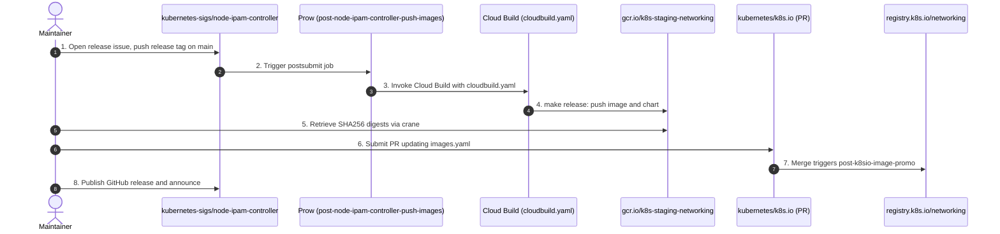

# Repository Maintenance & Release Guide

This document is the reference for repository maintenance, the external
infrastructure the project depends on, and the end-to-end release and promotion
process.

---

## Quick Reference: External Dashboards & Repositories

| Service / Resource | Link | Purpose |
| :--- | :--- | :--- |
| **TestGrid** | [`sig-network-node-ipam-controller`](https://testgrid.k8s.io/sig-network-node-ipam-controller) | Status and logs of the image push job. |
| **Prow CI Status** | [Prow Dashboard (`kubernetes-sigs/node-ipam-controller`)](https://prow.k8s.io/?repo=kubernetes-sigs%2Fnode-ipam-controller) | Live and historical Prow job runs. |
| **Prow Release Job Config** | [`k8s-staging-node-ipam-controller.yaml` in `kubernetes/test-infra`](https://github.com/kubernetes/test-infra/blob/master/config/jobs/image-pushing/k8s-staging-node-ipam-controller.yaml) | Defines the `post-node-ipam-controller-push-images` postsubmit and its TestGrid tabs. |
| **Prow Test Jobs Config** | [`jobs/kubernetes-sigs/node-ipam-controller/` in `kubernetes/test-infra`](https://github.com/kubernetes/test-infra/tree/master/config/jobs/kubernetes-sigs/node-ipam-controller) | Placeholder for Prow presubmits and periodics. There are none yet; PR testing runs in GitHub Actions. |
| **GCP Staging Registry UI** | [Artifact Registry (`node-ipam-controller`)](https://console.cloud.google.com/artifacts/docker/k8s-staging-networking/us/gcr.io/node-ipam-controller) | Container images pushed to `gcr.io/k8s-staging-networking/node-ipam-controller`. |
| **GCP Staging Charts UI** | [Artifact Registry (`charts/node-ipam-controller`)](https://console.cloud.google.com/artifacts/docker/k8s-staging-networking/us/gcr.io/charts%2Fnode-ipam-controller) | Helm charts pushed to `gcr.io/k8s-staging-networking/charts/node-ipam-controller`. |
| **Image Promotion Manifest** | [`images.yaml` in `kubernetes/k8s.io`](https://github.com/kubernetes/k8s.io/blob/main/registry.k8s.io/images/k8s-staging-networking/images.yaml) | Promotes images and charts from staging to `registry.k8s.io`. Shared with other SIG Network projects. |
| **Image Promo Job Status** | [TestGrid `post-k8sio-image-promo`](https://testgrid.k8s.io/sig-k8s-infra-k8sio#post-k8sio-image-promo) | The postsubmit that copies promoted artifacts to `registry.k8s.io`. |
| **GitHub Teams** | [`teams.yaml` in `kubernetes/org`](https://github.com/kubernetes/org/blob/main/config/kubernetes-sigs/sig-network/teams.yaml) | `node-ipam-controller-maintainers` has write access and can push release tags. |
| **Slack** | [`#sig-network` on Kubernetes Slack](https://kubernetes.slack.com/messages/sig-network) | Discussions and release announcements. |

---

## Automated Workflows

- **Pull Request Testing** runs in GitHub Actions:
  - [`test.yml`](./.github/workflows/test.yml): golangci-lint and unit tests.
  - [`e2e.yml`](./.github/workflows/e2e.yml): end-to-end tests on a Kind
    cluster.
  - [`test_charts.yml`](./.github/workflows/test_charts.yml): installs the Helm
    chart with `ct` when a PR changes `charts/`.
  - [`dependabot.yml`](./.github/dependabot.yml): weekly Go module, GitHub
    Actions and Dockerfile updates.
- **Staging Builds on Every Merge**: after every merge to `main` or a
  `release-*` branch, and whenever a semver tag is pushed, the Prow postsubmit
  [`post-node-ipam-controller-push-images`](https://github.com/kubernetes/test-infra/blob/master/config/jobs/image-pushing/k8s-staging-node-ipam-controller.yaml)
  runs [`cloudbuild.yaml`](./cloudbuild.yaml) -> `make release`. This pushes the
  container image and the Helm chart to `gcr.io/k8s-staging-networking`.

---

## Release & Promotion Process

Every release ships a container image and a Helm chart, promoted through the
[Kubernetes Image Promotion Pipeline](https://github.com/kubernetes/k8s.io/blob/main/registry.k8s.io/README.md):

- **Container image**: `registry.k8s.io/networking/node-ipam-controller:v0.x.y`,
  for `linux/amd64` and `linux/arm64`
- **Helm chart**: `oci://registry.k8s.io/networking/charts/node-ipam-controller`,
  version `0.x.y`

The promoter signs both artifacts with cosign.



### Staging vs. Production Registry

| Artifact | Staging Registry (Cloud Build Output) | Production Registry (Promoted) | Version Example |
| :--- | :--- | :--- | :--- |
| **Container Image** | `gcr.io/k8s-staging-networking/node-ipam-controller` | `registry.k8s.io/networking/node-ipam-controller` | `v0.3.0` |
| **Helm Chart (OCI)** | `oci://gcr.io/k8s-staging-networking/charts/node-ipam-controller` | `oci://registry.k8s.io/networking/charts/node-ipam-controller` | `0.3.0` |

### Versioning

Releases follow semver and are tagged `vX.Y.Z` on `main`. The chart version is
the tag without the leading `v`, and its `appVersion` is the tag itself.
`make helm-package` sets both at package time, so `Chart.yaml` doesn't need a
bump before a release.

There are no release branches. If a patch is needed for an older minor version
after `main` has moved on, create `release-X.Y` from the last `vX.Y.*` tag,
cherry-pick the fix, and tag the release branch. The push job builds `release-*`
branches too.

---

### Open a Release Issue

Open an issue with the
[New Release](https://github.com/kubernetes-sigs/node-ipam-controller/issues/new?template=NEW_RELEASE.md)
template and fill in the changelog. At least one approver from [OWNERS](./OWNERS)
other than the person cutting the release must `/lgtm` the issue before the tag
is pushed.

Before tagging, check that `main` is green in GitHub Actions and that the last
`post-node-ipam-controller-push-images` run on
[TestGrid](https://testgrid.k8s.io/sig-network-node-ipam-controller) passed.

---

### Push a Release Tag

Only members of `node-ipam-controller-maintainers` can push tags. Sign the tag
with a GPG or SSH key registered on GitHub:

```bash
git checkout main
git pull upstream main  # upstream is kubernetes-sigs/node-ipam-controller
git tag -s v0.3.0 -m "Release v0.3.0"
git push upstream v0.3.0
```

The tag triggers
[`post-node-ipam-controller-push-images`](https://github.com/kubernetes/test-infra/blob/master/config/jobs/image-pushing/k8s-staging-node-ipam-controller.yaml),
which runs `make release` in Cloud Build and pushes:

- `gcr.io/k8s-staging-networking/node-ipam-controller:v0.3.0` (also tagged
  `vYYYYMMDD-v0.3.0`)
- `oci://gcr.io/k8s-staging-networking/charts/node-ipam-controller:0.3.0`

---

### Draft the GitHub Release

Create a draft release with notes generated from the merged PRs.
[`.github/release.yml`](./.github/release.yml) groups Dependabot updates in a
separate section.

```bash
gh release create v0.3.0 \
  --repo kubernetes-sigs/node-ipam-controller \
  --draft \
  --verify-tag \
  --title v0.3.0 \
  --generate-notes \
  --notes-start-tag v0.2.0
```

Edit the draft: call out breaking changes and add install instructions:

```bash
helm install node-ipam-controller \
  oci://registry.k8s.io/networking/charts/node-ipam-controller \
  --version 0.3.0 \
  --namespace nodeipam --create-namespace
```

Keep it a draft until the artifacts are promoted.

---

### Retrieve Artifact Digests

Once the Cloud Build run succeeds (watch
[TestGrid](https://testgrid.k8s.io/sig-network-node-ipam-controller)), get the
SHA256 digests with
[`crane`](https://github.com/google/go-containerregistry/blob/main/cmd/crane/README.md)
and paste them in the release issue:

```bash
crane digest gcr.io/k8s-staging-networking/node-ipam-controller:v0.3.0
crane digest gcr.io/k8s-staging-networking/charts/node-ipam-controller:0.3.0
```

---

### Promote Artifacts to Production

Open a pull request against
[`kubernetes/k8s.io`](https://github.com/kubernetes/k8s.io) that adds both
digests to
[`registry.k8s.io/images/k8s-staging-networking/images.yaml`](https://github.com/kubernetes/k8s.io/blob/main/registry.k8s.io/images/k8s-staging-networking/images.yaml).
Entries are sorted by name. The approvers are listed in the
[OWNERS](https://github.com/kubernetes/k8s.io/blob/main/registry.k8s.io/images/k8s-staging-networking/OWNERS)
file next to it.

```yaml
- name: charts/node-ipam-controller
  dmap:
    "sha256:<CHART_DIGEST>": ["0.3.0"]

- name: node-ipam-controller
  dmap:
    "sha256:<IMAGE_DIGEST>": ["v0.3.0"]
```

Promote the chart with the tag exactly matching its version, without the `v`.
Helm looks up `--version 0.3.0` as the OCI tag `0.3.0`, so a chart promoted as
`v0.3.0` can't be installed with `--version 0.3.0`.

Once the PR is merged,
[`post-k8sio-image-promo`](https://testgrid.k8s.io/sig-k8s-infra-k8sio#post-k8sio-image-promo)
copies both artifacts to `registry.k8s.io/networking`.

---

### Verify the Promotion

```bash
crane digest registry.k8s.io/networking/node-ipam-controller:v0.3.0
helm show chart oci://registry.k8s.io/networking/charts/node-ipam-controller --version 0.3.0
```

The digests must match the staging ones.

---

### Publish the GitHub Release & Announce

1. Publish the draft release and link it in the release issue.
2. Open a PR against `main` that updates `--version` in the
   [README install command](./README.md#installation) to the new release. The
   first release also switches the command from the local chart to
   `oci://registry.k8s.io/networking/charts/node-ipam-controller`.
3. Announce the release in
   [`#sig-network`](https://kubernetes.slack.com/messages/sig-network) and on
   the [SIG Network mailing list](https://groups.google.com/a/kubernetes.io/g/sig-network)
   with the subject `[ANNOUNCE] node-ipam-controller v0.3.0 is released`.
4. Close the release issue.
